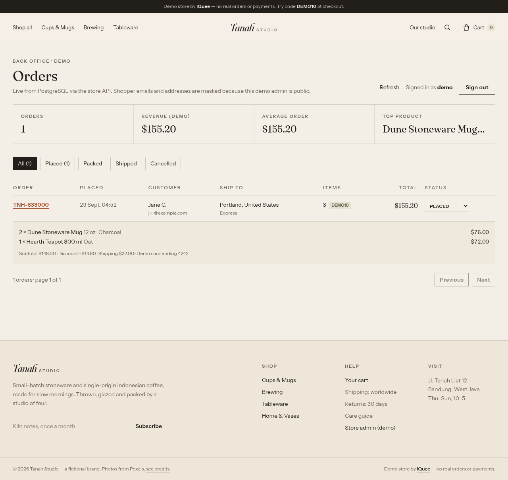
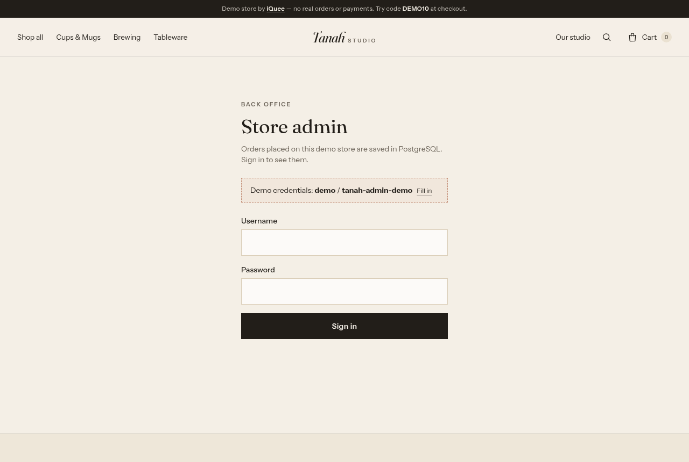

# Tanah Studio — full-stack e-commerce demo by iQuee

A boutique store (handmade stoneware + Indonesian coffee) built as a portfolio piece: a React storefront backed by a
real **Node.js / Express / Prisma / PostgreSQL** API. Catalog, search, promo codes, server-side pricing and orders all
go through the API and are stored in PostgreSQL. A small password-protected back office lists the orders.
**Demo only — no payments are taken and nothing ships.** Live: https://shop.iquee.tech · Admin: https://shop.iquee.tech/admin

## Tech Stack

| Layer | Technology |
| --- | --- |
| Frontend | React 18.3 + TypeScript 5.6 (strict), Vite 5.4, Tailwind CSS 3.4, React Router 6.30, self-hosted fonts (Fraunces, Instrument Sans) |
| Backend / API | Node.js 20 + TypeScript, Express 4.22, zod 3 request validation, helmet, CORS allow-list, express-rate-limit |
| Database | PostgreSQL 16, accessed with Prisma ORM 6.19 (schema + versioned SQL migrations + seed script) |
| Auth (demo admin) | Username/password from env, constant-time compare, stateless HMAC-SHA256 signed bearer token (8 h) |
| Infrastructure | Docker (multi-stage image, non-root user, healthcheck), Docker Compose (API + DB, named volume, private network) |
| Web server | Nginx: serves the static SPA and reverse-proxies `/api/` to the API container on `127.0.0.1:8001`; Let's Encrypt TLS; Cloudflare in front |
| QA | Playwright end-to-end flow (`flow.py`), API smoke test (`server/scripts/smoke.mjs`) |

## Architecture

```
Browser ──HTTPS──> Cloudflare ──> Nginx (shop.iquee.tech)
                                   ├── /        -> /var/www/iquee-shop  (Vite build, SPA fallback)
                                   └── /api/    -> 127.0.0.1:8001 ──> [api]  Node 20 + Express + Prisma
                                                                        │   (Docker network "internal")
                                                                        └──> [db] PostgreSQL 16 (no host port, volume pgdata)
```

- **Catalog** — 16 products / 4 categories live in PostgreSQL (seeded from `server/src/seed-data.ts`). Filtering, search
  (case-insensitive across name, copy, JSON details and category) and sorting run in SQL via `GET /api/products`.
- **Cart** — kept in the browser (`localStorage`) for instant UX; it only stores product ids, options and quantities.
  **The server never trusts client prices**: `POST /api/cart/quote` and `POST /api/orders` re-price every line from the
  database (base price + option deltas), apply the promo code from the `promo_codes` table and compute shipping.
- **Orders** — created in a single Prisma write (order + items), numbered `TNH-######`, with a random access token so
  only the buyer's browser can open the confirmation page. Money is stored as integer cents.
- **Admin** — `/admin` page → `POST /api/admin/login` → bearer token → order list, stats, status updates. Because the demo
  credentials are public, shopper emails and addresses are masked in admin responses.

### API

| Method & path | Purpose |
| --- | --- |
| `GET /api/health` | Liveness + DB check (`SELECT 1`) |
| `GET /api/categories` | Categories with product counts |
| `GET /api/products?category=&q=&sort=featured\|newest\|price-asc\|price-desc\|name&min=&max=&featured=` | Product list (server-side filter/search/sort) + `priceMax` |
| `GET /api/products/:slug` | Product detail + 4 related products |
| `GET /api/shipping-methods` | Shipping options and free-shipping threshold |
| `POST /api/promo/validate` `{ code }` | Validate a promo code (`DEMO10`, `FREESHIP`) |
| `POST /api/cart/quote` `{ lines, promoCode, shippingMethod }` | Authoritative server-side cart pricing |
| `POST /api/orders` `{ lines, promoCode, shippingMethod, customer, payment }` | Create an order with server-computed totals (rate limited) |
| `GET /api/orders/:number?token=` | Order confirmation |
| `POST /api/admin/login` | Demo admin login → bearer token |
| `GET /api/admin/stats` · `GET /api/admin/orders?page=&status=` · `PATCH /api/admin/orders/:number/status` | Back office (bearer token) |

Demo admin: **`demo` / `tanah-admin-demo`** (public on purpose; data is fake and PII is masked).

## Local development

Requirements: Node 20+, PostgreSQL 14+ (or Docker).

```bash
# 1) database (either a local postgres or: docker compose up -d db  — add a ports mapping for local use)
createuser -P tanah && createdb -O tanah tanah

# 2) API
cd server
cp .env.example .env          # set DATABASE_URL, ADMIN_PASSWORD, ADMIN_TOKEN_SECRET
npm install
npx prisma migrate dev        # applies prisma/migrations
npm run db:seed:dev           # loads the 16 products, 4 categories, promo codes
npm run dev                   # http://localhost:8001/api/health
npm run test:api              # smoke test (set ADMIN_PASSWORD to include admin checks)

# 3) frontend (Vite proxies /api -> localhost:8001)
cd ..
npm install
npm run dev                   # http://localhost:5173
npm run build                 # type-check + build -> dist/
```

## Production (Docker Compose)

```bash
cp .env.example .env    # generate secrets: openssl rand -hex 24 / 32 ; chmod 600 .env
docker compose up -d --build        # project name: iquee-shop
curl http://127.0.0.1:8001/api/health
```

The API container runs `prisma migrate deploy` and the idempotent seed on start, then serves on port 8001, published
**only on 127.0.0.1**. PostgreSQL has no published port and persists to the named volume `pgdata`. Both containers use
`restart: unless-stopped`, memory limits and rotated logs. Nginx adds:

```nginx
location ^~ /api/ {
    proxy_pass http://127.0.0.1:8001;
    proxy_set_header Host $host;
    proxy_set_header X-Forwarded-For $proxy_add_x_forwarded_for;
    proxy_set_header X-Forwarded-Proto $scheme;
}
```

## Project layout

```
src/                 React storefront (pages, components, store/catalog + store/cart, lib/api.ts)
  pages/Admin.tsx    demo back office
server/
  prisma/            schema.prisma + migrations/
  src/               app.ts, routes/{catalog,checkout,admin}.ts, lib/{pricing,auth,serialize,http}.ts, seed.ts, seed-data.ts
  scripts/smoke.mjs  API end-to-end smoke test
  Dockerfile, docker-entrypoint.sh
docker-compose.yml   api + db
flow.py / shots.py   Playwright E2E flow + screenshots
```

## Screenshots

| Admin — orders from PostgreSQL | Admin — login |
| --- | --- |
|  |  |

Images: Pexels, stored locally as WebP (see CREDITS.md). Designed and built by [iQuee](https://iquee.tech).
